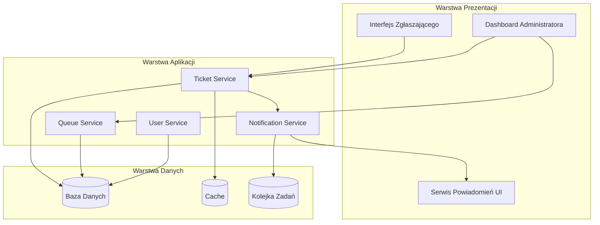
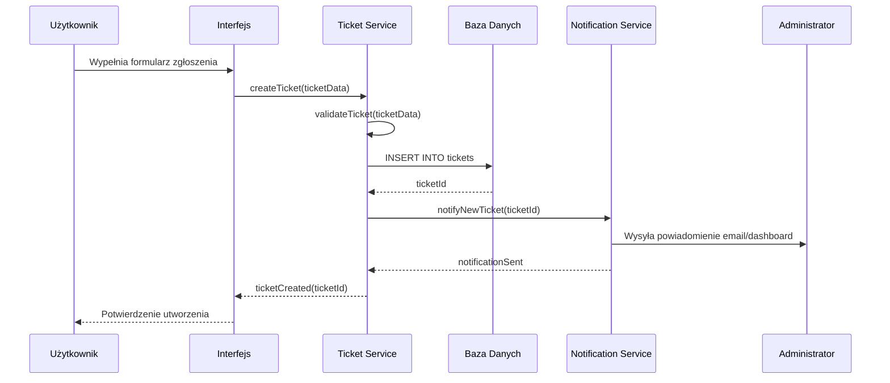
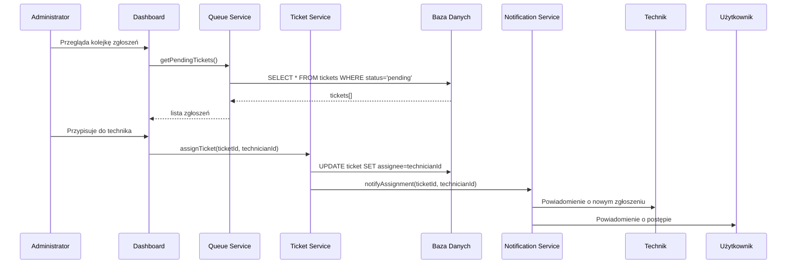

# Design Document: IT Ticket Management

## Overview

System zarządzania zgłoszeniami IT zapewnia prosty interfejs dla pracowników do zgłaszania problemów technicznych oraz rozbudowany dashboard dla administratorów IT do zarządzania kolejka zgłoszeń. System obsługuje pełny cykl życia zgłoszenia: od utworzenia, przez przypisanie, priorytetyzację, aż do rozwiązania i zamknięcia. Automatyczne powiadomienia informują zgłaszających o zmianach statusu, a kolejka zgłoszeń pozwala administratorom efektywnie zarządzać przepływem pracy.

## Architecture



## Sequence Diagrams

### Główny przepływ: Tworzenie i obsługa zgłoszenia



### Przypisanie zgłoszenia do technika



## Components and Interfaces

### Component 1: Ticket Service

**Purpose**: Zarządza cyklem życia zgłoszeń - tworzenie, aktualizacja, przypisywanie, zamykanie.

**Interface**:
```pascal
INTERFACE TicketService
  FUNCTION createTicket(data: TicketCreateInput): TicketResult
  FUNCTION getTicket(id: TicketId): TicketResult
  FUNCTION updateTicket(id: TicketId, data: TicketUpdateInput): TicketResult
  FUNCTION assignTicket(id: TicketId, assigneeId: UserId): TicketResult
  FUNCTION changeStatus(id: TicketId, status: TicketStatus): TicketResult
  FUNCTION addComment(id: TicketId, comment: CommentInput): CommentResult
  FUNCTION getTicketsByUser(userId: UserId): TicketListResult
  FUNCTION getTicketsByStatus(status: TicketStatus): TicketListResult
END INTERFACE
```

**Responsibilities**:
- Walidacja danych zgłoszenia przed utworzeniem
- Zarządzanie statusem zgłoszenia (automatyczne przejścia)
- Utrzymywanie historii zmian w zgłoszeniu
- Weryfikacja uprawnień do modyfikacji zgłoszenia

### Component 2: Queue Service

**Purpose**: Zarządza kolejką zgłoszeń, sortowanie, filtrowanie, priorytetyzacja.

**Interface**:
```pascal
INTERFACE QueueService
  FUNCTION getPendingTickets(filters: QueueFilters): TicketListResult
  FUNCTION getTicketsByPriority(priority: Priority): TicketListResult
  FUNCTION getTicketsByAssignee(assigneeId: UserId): TicketListResult
  FUNCTION reorderTicket(ticketId: TicketId, newPosition: Integer): QueueResult
  FUNCTION getQueueStatistics(): QueueStats
  FUNCTION escalateTicket(ticketId: TicketId): TicketResult
END INTERFACE
```

**Responsibilities**:
- Pobieranie zgłoszeń z filtrami i sortowaniem
- Obliczanie statystyk kolejki (SLA, czas odpowiedzi)
- Automatyczna eskalacja zgłoszeń przekraczających SLA
- Zarządzanie priorytetami w kolejce

### Component 3: Notification Service

**Purpose**: Wysyła powiadomienia do użytkowników o zmianach w zgłoszeniach.

**Interface**:
```pascal
INTERFACE NotificationService
  FUNCTION notifyTicketCreated(ticketId: TicketId): NotificationResult
  FUNCTION notifyTicketAssigned(ticketId: TicketId, assigneeId: UserId): NotificationResult
  FUNCTION notifyStatusChanged(ticketId: TicketId, newStatus: TicketStatus): NotificationResult
  FUNCTION notifyCommentAdded(ticketId: TicketId, commentId: CommentId): NotificationResult
  FUNCTION notifyTicketResolved(ticketId: TicketId): NotificationResult
  FUNCTION getUserNotifications(userId: UserId): NotificationListResult
  FUNCTION markAsRead(notificationId: NotificationId): NotificationResult
END INTERFACE
```

**Responsibilities**:
- Wysyłanie powiadomień email
- Powiadomienia w czasie rzeczywistym (WebSocket)
- Powiadomienia w dashboardzie
- Szablonowanie treści powiadomień

### Component 4: User Service

**Purpose**: Zarządza użytkownikami, rolami i uprawnieniami.

**Interface**:
```pascal
INTERFACE UserService
  FUNCTION getUser(id: UserId): UserResult
  FUNCTION getUserByRole(role: UserRole): UserListResult
  FUNCTION authenticateUser(credentials: Credentials): AuthResult
  FUNCTION hasPermission(userId: UserId, permission: Permission): Boolean
  FUNCTION updateUserPreferences(userId: UserId, prefs: Preferences): UserResult
END INTERFACE
```

**Responsibilities**:
- Uwierzytelnianie i autoryzacja użytkowników
- Zarządzanie rolami (Zgłaszający, Technik, Administrator)
- Przechowywanie preferencji powiadomień
- Walidacja uprawnień do operacji

## Data Models

### Model 1: Ticket

```pascal
STRUCTURE Ticket
  id: UUID
  title: String
  description: String
  category: TicketCategory
  priority: Priority
  status: TicketStatus
  reporterId: UserId
  assigneeId: UserId OPTIONAL
  createdAt: DateTime
  updatedAt: DateTime
  resolvedAt: DateTime OPTIONAL
  dueDate: DateTime OPTIONAL
  comments: List<Comment>
  attachments: List<Attachment>
  history: List<TicketHistoryEntry>
END STRUCTURE

ENUM TicketCategory
  HARDWARE
  SOFTWARE
  NETWORK
  ACCESS
  OTHER
END ENUM

ENUM Priority
  LOW
  MEDIUM
  HIGH
  CRITICAL
END ENUM

ENUM TicketStatus
  NEW
  IN_PROGRESS
  WAITING_FOR_INFO
  RESOLVED
  CLOSED
  REOPENED
END ENUM
```

**Validation Rules**:
- `title` nie może być pusty, max 200 znaków
- `description` nie może być pusta, max 5000 znaków
- `priority` musi być jedną z wartości enum
- `reporterId` musi istnieć w systemie
- `dueDate` musi być późniejsza niż `createdAt` (jeśli ustawiona)

### Model 2: User

```pascal
STRUCTURE User
  id: UUID
  email: String
  name: String
  role: UserRole
  department: String
  isActive: Boolean
  preferences: UserPreferences
  createdAt: DateTime
END STRUCTURE

ENUM UserRole
  REPORTER      // Zgłaszający - może tworzyć i przeglądać własne zgłoszenia
  TECHNICIAN    // Technik - może obsługiwać przypisane zgłoszenia
  ADMIN         // Administrator - pełny dostęp do dashboardu i kolejki
END ENUM

STRUCTURE UserPreferences
  emailNotifications: Boolean
  dashboardNotifications: Boolean
  language: String
END STRUCTURE
```

**Validation Rules**:
- `email` musi być poprawnym adresem email, unikalny w systemie
- `name` nie może być puste
- `role` musi być jedną z wartości enum

### Model 3: Comment

```pascal
STRUCTURE Comment
  id: UUID
  ticketId: TicketId
  authorId: UserId
  content: String
  isInternal: Boolean    // TRUE = widoczny tylko dla IT
  createdAt: DateTime
  attachments: List<Attachment>
END STRUCTURE
```

**Validation Rules**:
- `content` nie może być puste, max 2000 znaków
- `authorId` musi istnieć w systemie
- Tylko technicy i admini mogą tworzyć komentarze wewnętrzne

### Model 4: Notification

```pascal
STRUCTURE Notification
  id: UUID
  userId: UserId
  type: NotificationType
  title: String
  message: String
  ticketId: TicketId OPTIONAL
  isRead: Boolean
  createdAt: DateTime
  readAt: DateTime OPTIONAL
END STRUCTURE

ENUM NotificationType
  TICKET_CREATED
  TICKET_ASSIGNED
  STATUS_CHANGED
  COMMENT_ADDED
  TICKET_RESOLVED
  TICKET_ESCALATED
END ENUM
```

## Algorithmic Pseudocode

### Main Algorithm: Create Ticket

```pascal
ALGORITHM createTicket
INPUT: data of type TicketCreateInput
OUTPUT: result of type TicketResult

BEGIN
  // Precondition: data jest zdefiniowane
  ASSERT data IS NOT NULL
  
  // Step 1: Validate input data
  validationResult ← validateTicketInput(data)
  IF validationResult.isValid = FALSE THEN
    RETURN TicketResult.Error(validationResult.errors)
  END IF
  
  // Step 2: Verify reporter exists
  reporter ← userService.getUser(data.reporterId)
  IF reporter IS NULL THEN
    RETURN TicketResult.Error("Reporter not found")
  END IF
  
  // Step 3: Create ticket entity
  ticket ← new Ticket()
  ticket.id ← generateUUID()
  ticket.title ← data.title
  ticket.description ← data.description
  ticket.category ← data.category
  ticket.priority ← data.priority OR calculatePriority(data)
  ticket.status ← TicketStatus.NEW
  ticket.reporterId ← data.reporterId
  ticket.createdAt ← now()
  ticket.updatedAt ← now()
  
  // Step 4: Calculate due date based on priority
  ticket.dueDate ← calculateDueDate(ticket.priority)
  
  // Step 5: Save to database
  savedTicket ← database.insert(ticket)
  
  // Step 6: Send notifications
  notificationService.notifyTicketCreated(savedTicket.id)
  
  // Postcondition: Ticket został utworzony z poprawnymi danymi
  ASSERT savedTicket.id IS NOT NULL
  ASSERT savedTicket.status = TicketStatus.NEW
  
  RETURN TicketResult.Success(savedTicket)
END
```

**Preconditions**:
- `data` jest zdefiniowane i nie jest null
- `data.reporterId` odnosi się do istniejącego użytkownika
- `data.title` i `data.description` są niepuste

**Postconditions**:
- Zwrócony ticket ma poprawny id
- Status ticketu to NEW
- Data utworzenia jest ustawiona
- Powiadomienie zostało wysłane do administratorów

### Algorithm: Assign Ticket

```pascal
ALGORITHM assignTicket
INPUT: ticketId of type TicketId, assigneeId of type UserId
OUTPUT: result of type TicketResult

BEGIN
  // Precondition: Parametry są zdefiniowane
  ASSERT ticketId IS NOT NULL
  ASSERT assigneeId IS NOT NULL
  
  // Step 1: Retrieve ticket
  ticket ← database.getTicket(ticketId)
  IF ticket IS NULL THEN
    RETURN TicketResult.Error("Ticket not found")
  END IF
  
  // Step 2: Verify assignee exists and has appropriate role
  assignee ← userService.getUser(assigneeId)
  IF assignee IS NULL THEN
    RETURN TicketResult.Error("Assignee not found")
  END IF
  
  IF assignee.role NOT IN [UserRole.TECHNICIAN, UserRole.ADMIN] THEN
    RETURN TicketResult.Error("Assignee must be technician or admin")
  END IF
  
  // Step 3: Check if ticket can be assigned
  IF ticket.status = TicketStatus.CLOSED THEN
    RETURN TicketResult.Error("Cannot assign closed ticket")
  END IF
  
  // Step 4: Update ticket
  previousAssignee ← ticket.assigneeId
  ticket.assigneeId ← assigneeId
  ticket.status ← TicketStatus.IN_PROGRESS
  ticket.updatedAt ← now()
  
  // Step 5: Add history entry
  historyEntry ← new TicketHistoryEntry()
  historyEntry.action ← "ASSIGNED"
  historyEntry.previousValue ← previousAssignee
  historyEntry.newValue ← assigneeId
  historyEntry.timestamp ← now()
  ticket.history.add(historyEntry)
  
  // Step 6: Save changes
  database.update(ticket)
  
  // Step 7: Send notifications
  notificationService.notifyTicketAssigned(ticketId, assigneeId)
  IF previousAssignee IS NOT NULL THEN
    notificationService.notifyReassignment(ticketId, previousAssignee)
  END IF
  
  // Postcondition: Ticket przypisany do technika
  ASSERT ticket.assigneeId = assigneeId
  ASSERT ticket.status = TicketStatus.IN_PROGRESS
  
  RETURN TicketResult.Success(ticket)
END
```

**Preconditions**:
- `ticketId` odnosi się do istniejącego ticketu
- `assigneeId` odnosi się do użytkownika z rolą TECHNICIAN lub ADMIN
- Ticket nie jest zamknięty

**Postconditions**:
- Ticket jest przypisany do wskazanego technika
- Status zmienił się na IN_PROGRESS
- Historia zawiera wpis o przypisaniu
- Powiadomienia zostały wysłane

### Algorithm: Get Pending Tickets (Queue)

```pascal
ALGORITHM getPendingTickets
INPUT: filters of type QueueFilters
OUTPUT: result of type TicketListResult

BEGIN
  // Step 1: Build query based on filters
  query ← "SELECT * FROM tickets WHERE status NOT IN (RESOLVED, CLOSED)"
  
  IF filters.priority IS NOT NULL THEN
    query.append(" AND priority = ?", filters.priority)
  END IF
  
  IF filters.category IS NOT NULL THEN
    query.append(" AND category = ?", filters.category)
  END IF
  
  IF filters.assigneeId IS NOT NULL THEN
    query.append(" AND assigneeId = ?", filters.assigneeId)
  END IF
  
  // Step 2: Apply sorting
  sortBy ← filters.sortBy OR "priority"
  sortOrder ← filters.sortOrder OR "DESC"
  
  IF sortBy = "priority" THEN
    // CRITICAL > HIGH > MEDIUM > LOW
    query.append(" ORDER BY FIELD(priority, 'CRITICAL', 'HIGH', 'MEDIUM', 'LOW')")
  ELSE IF sortBy = "createdAt" THEN
    query.append(" ORDER BY createdAt " + sortOrder)
  ELSE IF sortBy = "dueDate" THEN
    query.append(" ORDER BY dueDate ASC")
  END IF
  
  // Step 3: Apply pagination
  page ← filters.page OR 1
  pageSize ← filters.pageSize OR 20
  offset ← (page - 1) * pageSize
  query.append(" LIMIT ? OFFSET ?", pageSize, offset)
  
  // Step 4: Execute query
  tickets ← database.query(query)
  
  // Step 5: Calculate total count for pagination
  countQuery ← "SELECT COUNT(*) FROM tickets WHERE status NOT IN (RESOLVED, CLOSED)"
  totalCount ← database.queryScalar(countQuery)
  
  // Postcondition: Zwrócona lista jest zgodna z filtrami
  FOR each ticket IN tickets DO
    ASSERT ticket.status NOT IN (RESOLVED, CLOSED)
  END FOR
  
  RETURN TicketListResult.Success(tickets, totalCount, page, pageSize)
END
```

**Preconditions**:
- `filters` jest zdefiniowane (może być puste)

**Postconditions**:
- Zwrócone tickety nie są w statusie RESOLVED lub CLOSED
- Wyniki są posortowane zgodnie z parametrami
- Paginacja jest poprawnie zastosowana

**Loop Invariants**:
- Wszystkie zwrócone tickety spełniają kryteria filtrów
- Kolejność ticketów jest zgodna z parametrem sortowania

### Algorithm: Change Ticket Status

```pascal
ALGORITHM changeStatus
INPUT: ticketId of type TicketId, newStatus of type TicketStatus, userId of type UserId
OUTPUT: result of type TicketResult

BEGIN
  // Step 1: Retrieve ticket
  ticket ← database.getTicket(ticketId)
  IF ticket IS NULL THEN
    RETURN TicketResult.Error("Ticket not found")
  END IF
  
  // Step 2: Validate status transition
  previousStatus ← ticket.status
  isValidTransition ← validateStatusTransition(previousStatus, newStatus)
  
  IF isValidTransition = FALSE THEN
    RETURN TicketResult.Error("Invalid status transition from " + previousStatus + " to " + newStatus)
  END IF
  
  // Step 3: Check permissions
  user ← userService.getUser(userId)
  canChangeStatus ← checkStatusChangePermission(user, ticket, newStatus)
  
  IF canChangeStatus = FALSE THEN
    RETURN TicketResult.Error("Permission denied")
  END IF
  
  // Step 4: Update ticket
  ticket.status ← newStatus
  ticket.updatedAt ← now()
  
  IF newStatus = TicketStatus.RESOLVED THEN
    ticket.resolvedAt ← now()
  END IF
  
  // Step 5: Add history entry
  historyEntry ← new TicketHistoryEntry()
  historyEntry.action ← "STATUS_CHANGED"
  historyEntry.previousValue ← previousStatus
  historyEntry.newValue ← newStatus
  historyEntry.changedBy ← userId
  historyEntry.timestamp ← now()
  ticket.history.add(historyEntry)
  
  // Step 6: Save changes
  database.update(ticket)
  
  // Step 7: Send notifications based on status
  IF newStatus = TicketStatus.RESOLVED THEN
    notificationService.notifyTicketResolved(ticketId)
  ELSE
    notificationService.notifyStatusChanged(ticketId, newStatus)
  END IF
  
  // Postcondition: Status został zmieniony
  ASSERT ticket.status = newStatus
  
  RETURN TicketResult.Success(ticket)
END
```

**Valid Status Transitions**:
```pascal
FUNCTION validateStatusTransition(from: TicketStatus, to: TicketStatus): Boolean
BEGIN
  CASE from OF
    TicketStatus.NEW:
      RETURN to IN [TicketStatus.IN_PROGRESS, TicketStatus.CLOSED]
    TicketStatus.IN_PROGRESS:
      RETURN to IN [TicketStatus.WAITING_FOR_INFO, TicketStatus.RESOLVED, TicketStatus.CLOSED]
    TicketStatus.WAITING_FOR_INFO:
      RETURN to IN [TicketStatus.IN_PROGRESS, TicketStatus.CLOSED]
    TicketStatus.RESOLVED:
      RETURN to IN [TicketStatus.CLOSED, TicketStatus.REOPENED]
    TicketStatus.CLOSED:
      RETURN to = TicketStatus.REOPENED
    TicketStatus.REOPENED:
      RETURN to IN [TicketStatus.IN_PROGRESS, TicketStatus.CLOSED]
    DEFAULT:
      RETURN FALSE
  END CASE
END
```

### Algorithm: Escalate Ticket

```pascal
ALGORITHM escalateTicket
INPUT: ticketId of type TicketId
OUTPUT: result of type TicketResult

BEGIN
  // Step 1: Retrieve ticket
  ticket ← database.getTicket(ticketId)
  IF ticket IS NULL THEN
    RETURN TicketResult.Error("Ticket not found")
  END IF
  
  // Step 2: Check escalation conditions
  shouldEscalate ← FALSE
  escalationReason ← ""
  
  // Check SLA breach
  IF ticket.dueDate IS NOT NULL AND now() > ticket.dueDate THEN
    shouldEscalate ← TRUE
    escalationReason ← "SLA breach: ticket overdue"
  END IF
  
  // Check no activity for 48 hours
  lastActivity ← getLastActivityTime(ticket)
  IF now() - lastActivity > 48 HOURS THEN
    shouldEscalate ← TRUE
    escalationReason ← "No activity for 48 hours"
  END IF
  
  // Check high priority ticket without assignee
  IF ticket.priority IN [Priority.HIGH, Priority.CRITICAL] AND ticket.assigneeId IS NULL THEN
    shouldEscalate ← TRUE
    escalationReason ← "High priority ticket unassigned"
  END IF
  
  IF shouldEscalate = FALSE THEN
    RETURN TicketResult.Error("Ticket does not meet escalation criteria")
  END IF
  
  // Step 3: Escalate - increase priority
  previousPriority ← ticket.priority
  ticket.priority ← getNextPriority(ticket.priority)
  ticket.updatedAt ← now()
  
  // Step 4: Add history entry
  historyEntry ← new TicketHistoryEntry()
  historyEntry.action ← "ESCALATED"
  historyEntry.previousValue ← previousPriority
  historyEntry.newValue ← ticket.priority
  historyEntry.reason ← escalationReason
  historyEntry.timestamp ← now()
  ticket.history.add(historyEntry)
  
  // Step 5: Save changes
  database.update(ticket)
  
  // Step 6: Notify admins
  admins ← userService.getUserByRole(UserRole.ADMIN)
  FOR each admin IN admins DO
    notificationService.notifyEscalation(ticketId, admin.id, escalationReason)
  END FOR
  
  // Postcondition: Priorytet został podniesiony
  ASSERT ticket.priority > previousPriority
  
  RETURN TicketResult.Success(ticket)
END
```

## Key Functions with Formal Specifications

### Function 1: validateTicketInput()

```pascal
FUNCTION validateTicketInput(data: TicketCreateInput): ValidationResult
```

**Preconditions:**
- `data` jest zdefiniowane (nie null/undefined)

**Postconditions:**
- Zwraca ValidationResult z polem `isValid` (boolean)
- Jeśli `isValid = false`, zawiera listę błędów walidacji
- Nie modyfikuje danych wejściowych

### Function 2: calculateDueDate()

```pascal
FUNCTION calculateDueDate(priority: Priority): DateTime
```

**Preconditions:**
- `priority` jest jedną z wartości enum Priority

**Postconditions:**
- Zwraca datę zgodną z SLA dla danego priorytetu
- CRITICAL: 4 godziny
- HIGH: 8 godzin
- MEDIUM: 24 godziny
- LOW: 72 godziny

### Function 3: checkStatusChangePermission()

```pascal
FUNCTION checkStatusChangePermission(user: User, ticket: Ticket, newStatus: TicketStatus): Boolean
```

**Preconditions:**
- `user`, `ticket`, `newStatus` są zdefiniowane

**Postconditions:**
- Zwraca `true` jeśli użytkownik ma prawo zmienić status
- Admin może zmienić każdy status
- Technik może zmienić status tylko przypisanych ticketów
- Zgłaszający może tylko zamknąć własny ticket

## Example Usage

### Example 1: User creates a new ticket

```pascal
SEQUENCE
  // User fills out the form
  ticketData ← new TicketCreateInput()
  ticketData.title ← "Monitor nie działa"
  ticketData.description ← "Ekran stanął w miejscu, nie reaguje na przyciski"
  ticketData.category ← TicketCategory.HARDWARE
  ticketData.priority ← Priority.MEDIUM
  ticketData.reporterId ← currentUser.id
  
  // Submit ticket
  result ← ticketService.createTicket(ticketData)
  
  IF result.isSuccess THEN
    DISPLAY "Zgłoszenie utworzone: " + result.ticket.id
    DISPLAY "Przewidywany czas realizacji: " + result.ticket.dueDate
  ELSE
    DISPLAY "Błąd: " + result.error
  END IF
END SEQUENCE
```

### Example 2: Admin assigns ticket to technician

```pascal
SEQUENCE
  // Admin views queue
  filters ← new QueueFilters()
  filters.status ← TicketStatus.NEW
  pendingTickets ← queueService.getPendingTickets(filters)
  
  DISPLAY "Zgłoszenia oczekujące:"
  FOR each ticket IN pendingTickets DO
    DISPLAY ticket.id + ": " + ticket.title + " (" + ticket.priority + ")"
  END FOR
  
  // Admin selects ticket and assigns
  selectedTicketId ← "123e4567-e89b-12d3-a456-426614174000"
  technicianId ← "987e6543-e21b-12d3-a456-426614174000"
  
  result ← ticketService.assignTicket(selectedTicketId, technicianId)
  
  IF result.isSuccess THEN
    DISPLAY "Zgłoszenie przypisane do technika"
  ELSE
    DISPLAY "Błąd: " + result.error
  END IF
END SEQUENCE
```

### Example 3: Technician resolves ticket

```pascal
SEQUENCE
  ticketId ← "123e4567-e89b-12d3-a456-426614174000"
  
  // Add resolution comment
  comment ← new CommentInput()
  comment.content ← "Wymieniono kabel zasilający. Monitor działa poprawnie."
  comment.isInternal ← FALSE
  ticketService.addComment(ticketId, comment)
  
  // Change status to resolved
  result ← ticketService.changeStatus(ticketId, TicketStatus.RESOLVED, currentUserId)
  
  IF result.isSuccess THEN
    DISPLAY "Zgłoszenie rozwiązane"
    // User will be notified automatically
  END IF
END SEQUENCE
```

### Example 4: User reopens ticket

```pascal
SEQUENCE
  ticketId ← "123e4567-e89b-12d3-a456-426614174000"
  
  // Add comment explaining why reopening
  comment ← new CommentInput()
  comment.content ← "Problem powrócił - monitor ponownie nie działa"
  comment.isInternal ← FALSE
  ticketService.addComment(ticketId, comment)
  
  // Reopen ticket
  result ← ticketService.changeStatus(ticketId, TicketStatus.REOPENED, currentUserId)
  
  IF result.isSuccess THEN
    DISPLAY "Zgłoszenie ponownie otwarte"
  END IF
END SEQUENCE
```

## Correctness Properties

*A property is a characteristic or behavior that should hold true across all valid executions of a system-essentially, a formal statement about what the system should do. Properties serve as the bridge between human-readable specifications and machine-verifiable correctness guarantees.*

### Property 1: Valid Status Transitions

*For any* ticket and any sequence of status changes applied to it, each transition must be permitted by the defined state machine (NEW→IN_PROGRESS, NEW→CLOSED, IN_PROGRESS→WAITING_FOR_INFO, IN_PROGRESS→RESOLVED, IN_PROGRESS→CLOSED, WAITING_FOR_INFO→IN_PROGRESS, WAITING_FOR_INFO→CLOSED, RESOLVED→CLOSED, RESOLVED→REOPENED, CLOSED→REOPENED, REOPENED→IN_PROGRESS, REOPENED→CLOSED), and any transition not in this set must be rejected.

**Validates: Requirements 2.1, 2.2**

### Property 2: Input Validation Correctness

*For any* string input, the ticket validation function shall accept titles of 1-200 characters and reject empty or longer titles; accept descriptions of 1-5000 characters and reject empty or longer descriptions; accept only valid category values (HARDWARE, SOFTWARE, NETWORK, ACCESS, OTHER); accept only valid priority values (LOW, MEDIUM, HIGH, CRITICAL); and accept comment content of 1-2000 characters and reject empty or longer content.

**Validates: Requirements 1.2, 1.3, 1.4, 11.1, 11.2, 11.3, 11.4, 11.6**

### Property 3: SLA Due Date Calculation

*For any* ticket with a given priority, the calculated due date shall equal the creation time plus the SLA duration for that priority (CRITICAL=4h, HIGH=8h, MEDIUM=24h, LOW=72h), and the due date shall always be strictly later than the creation date.

**Validates: Requirements 1.5, 9.1, 9.2, 9.3, 9.4, 9.5**

### Property 4: Assignment Role Enforcement

*For any* ticket assignment operation, if the target user has role TECHNICIAN or ADMIN and the ticket is not CLOSED, the assignment shall succeed and the ticket status shall change to IN_PROGRESS; if the target user has role REPORTER, the assignment shall be rejected; if the ticket is CLOSED, the assignment shall be rejected regardless of user role.

**Validates: Requirements 3.1, 3.2, 3.3**

### Property 5: History Audit Trail Integrity

*For any* ticket, after any modification, a history entry shall be created containing a non-null action type, non-null user reference, non-null timestamp not in the future, and the previous and new values. All history entries for a ticket shall be in chronological order.

**Validates: Requirements 2.4, 3.4, 5.4, 10.1, 10.2, 10.3, 10.4**

### Property 6: Queue Filtering Invariant

*For any* set of tickets and any filter criteria applied to the queue, all returned tickets shall match the filter criteria, and no ticket with status RESOLVED or CLOSED shall appear in the pending queue results.

**Validates: Requirements 4.1, 4.2**

### Property 7: Queue Sorting Correctness

*For any* set of tickets in the queue, sorting by priority shall produce the order CRITICAL > HIGH > MEDIUM > LOW, and sorting by date fields shall produce results in the specified ascending or descending order.

**Validates: Requirements 4.3, 4.4**

### Property 8: Pagination Consistency

*For any* page number, page size, and total ticket count, the returned page shall contain at most pageSize items, the offset shall equal (page-1)*pageSize, and the total count shall reflect the full unfiltered result set size.

**Validates: Requirements 4.5**

### Property 9: Escalation Trigger Conditions

*For any* ticket that has passed its due date, or has had no activity for 48 hours, or has HIGH/CRITICAL priority with no assignee, the escalation function shall increase the ticket's priority and record the escalation reason.

**Validates: Requirements 5.1, 5.2, 5.3, 5.4**

### Property 10: Permission Enforcement

*For any* user-ticket-operation combination, a Reporter shall only be able to view and close their own tickets; a Technician shall only be able to change status on tickets assigned to them; an Administrator shall be able to perform all operations on all tickets. Any unauthorized operation shall be rejected.

**Validates: Requirements 8.1, 8.2, 8.3, 8.4**

### Property 11: Internal Comment Visibility

*For any* comment marked as internal, it shall be visible only to users with TECHNICIAN or ADMIN role, and a Reporter shall never be able to create an internal comment.

**Validates: Requirements 6.3, 6.4**

### Property 12: Notification Ordering

*For any* user, their notification list shall be returned ordered by creation date, and marking a notification as read shall set a read timestamp without affecting other notifications.

**Validates: Requirements 7.2, 7.3**

## Error Handling

### Error Scenario 1: Ticket Not Found

**Condition**: Operacja na nieistniejącym ticketcie
**Response**: Zwróć błąd `TICKET_NOT_FOUND` z identyfikatorem ticketu
**Recovery**: Pozwól użytkownikowi wyszukać ticket lub utworzyć nowy

### Error Scenario 2: Permission Denied

**Condition**: Użytkownik bez uprawnień próbuje wykonać operację
**Response**: Zwróć błąd `PERMISSION_DENIED` z informacją o wymaganej roli
**Recovery**: Zaproponuj kontakt z administratorem lub przekierowanie do właściwego interfejsu

### Error Scenario 3: Invalid Status Transition

**Condition**: Próba zmiany statusu niezgodna z maszyną stanów
**Response**: Zwróć błąd `INVALID_STATUS_TRANSITION` z informacją o dozwolonych przejściach
**Recovery**: Wyświetl aktualny status i możliwe akcje

### Error Scenario 4: SLA Breach Detected

**Condition**: Automatyczne wykrycie przekroczenia terminu SLA
**Response**: Eskalacja ticketu, powiadomienie administratorów
**Recovery**: Priorytetyzacja w kolejce, automatyczne przypisanie

### Error Scenario 5: Duplicate Ticket Submission

**Condition**: Użytkownik próbuje utworzyć ticket o tym samym tytule w krótkim czasie
**Response**: Zwróć ostrzeżenie o możliwym duplikacie
**Recovery**: Zaproponuj dodanie komentarza do istniejącego ticketu zamiast tworzenia nowego

## Testing Strategy

### Unit Testing Approach

**Coverage Goals**: Minimum 80% code coverage

**Key Test Cases**:
1. Walidacja danych ticketu (poprawne i niepoprawne)
2. Przejścia statusów (wszystkie dozwolone i niedozwolone)
3. Uprawnienia użytkowników (wszystkie role)
4. Obliczanie terminów SLA (wszystkie priorytety)
5. Filtrowanie i sortowanie kolejki
6. Tworzenie powiadomień

### Property-Based Testing Approach

**Property Test Library**: fast-check (JavaScript/TypeScript)

**Properties to Test**:
1. **Status Transition Validity**: Dla dowolnego ticketu, każda zmiana statusu musi być zgodna z maszyną stanów
2. **Priority Ordering**: Dla dowolnych dwóch ticketów z różnymi priorytetami, kolejność sortowania jest deterministyczna
3. **Notification Delivery**: Dla dowolnej operacji zmieniającej ticket, odpowiednie powiadomienia są wysyłane
4. **History Integrity**: Dla dowolnej sekwencji zmian, historia jest spójna i uporządkowana chronologicznie
5. **Due Date Calculation**: Dla dowolnego priorytetu, due date jest zgodny ze SLA

### Integration Testing Approach

**Test Scenarios**:
1. Pełny cykl życia ticketu: utworzenie → przypisanie → rozwiązanie → zamknięcie
2. Eskalacja automatyczna po przekroczeniu SLA
3. Powiadomienia email dla wszystkich typów zdarzeń
4. Synchronizacja kolejki między wieloma administratorami (WebSocket)
5. Współbieżne modyfikacje ticketu (optymistyczne blokowanie)

## Performance Considerations

### Expected Load
- 1000 aktywnych zgłoszeń
- 100 jednoczesnych użytkowników (80 zgłaszających, 15 techników, 5 adminów)
- 100 nowych zgłoszeń dziennie

### Response Time Requirements
- Lista zgłoszeń: < 500ms (z filtrowaniem i sortowaniem)
- Szczegóły zgłoszenia: < 200ms
- Utworzenie zgłoszenia: < 300ms
- Powiadomienia w czasie rzeczywistym: < 1s opóźnienia

### Optimization Strategies
1. **Indeksowanie bazy danych**: indeksy na status, priority, assigneeId, createdAt
2. **Cache**: Redis dla często dostępnych danych (kolejka, statystyki)
3. **Paginacja**: domyślnie 20 elementów na stronę
4. **WebSocket**: dla powiadomień w czasie rzeczywistym zamiast polling
5. **Background Jobs**: dla wysyłki emaili (kolejka zadań)

## Security Considerations

### Authentication & Authorization
- Uwierzytelnianie przez SSO/LDAP (integracja z Active Directory)
- Tokeny JWT z krótkim czasem życia (15 minut)
- Odświeżanie tokenów przez secure, httpOnly cookies

### Access Control
- Role-Based Access Control (RBAC)
- Zgłaszający widzi tylko własne zgłoszenia
- Technik widzi przypisane zgłoszenia i kolejkę
- Admin ma pełny dostęp

### Data Protection
- Szyfrowanie połączeń (TLS 1.3)
- Szyfrowanie załączników w spoczynku
- Sanityzacja danych wejściowych (XSS prevention)
- Parametryzowane zapytania SQL (SQL injection prevention)

### Audit Logging
- Wszystkie zmiany w ticketach zapisywane w historii
- Logi dostępu i operacji administracyjnych
- Retencja logów: 1 rok

## Dependencies

### Runtime Dependencies
- Node.js 18+ / Python 3.11+ (do ustalenia)
- PostgreSQL 15+ (baza danych)
- Redis 7+ (cache, kolejka zadań, sesje)
- WebSocket server (Socket.io / ws)

### External Services
- SMTP server (wysyłka email)
- LDAP/Active Directory (uwierzytelnianie)
- Storage service (S3/MinIO dla załączników)

### Development Dependencies
- Testing framework: Jest / Vitest
- Property-based testing: fast-check
- API documentation: OpenAPI/Swagger
- Linting: ESLint / Pylint
