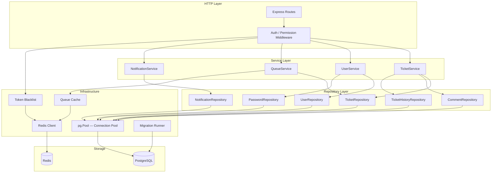
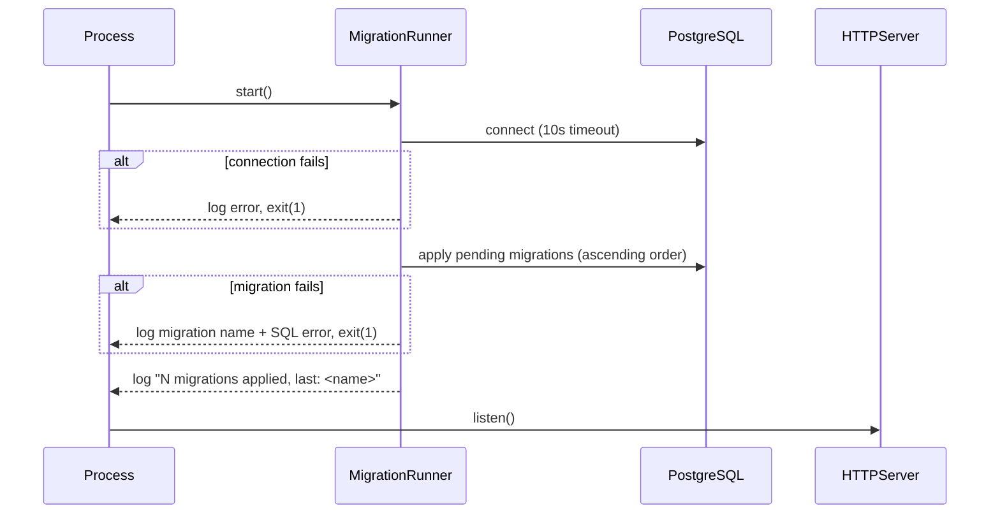

# Design Document: IT Ticket Management — Persistent Data Layer

## Overview

This design covers the migration from an in-memory storage layer to a fully persistent, production-ready data layer for the IT Ticket Management System. The work spans three interconnected areas:

1. **Database migration system** — versioned, forward-only SQL migrations managed by `node-pg-migrate`, replacing the static `schema.sql` file and running automatically on startup.
2. **PostgreSQL repository implementation** — full implementations of all repository classes (`TicketRepository`, `UserRepository`, `CommentRepository`, `NotificationRepository`, `TicketHistoryRepository`, `PasswordRepository`) so all services persist data to PostgreSQL.
3. **Redis caching layer** — the existing queue cache and a new JWT token blacklist wired into the running application, with graceful degradation when Redis is unavailable.

The existing service interfaces (`ITicketService`, `IUserService`, `IQueueService`, `INotificationService`) and all route handlers remain unchanged. The health endpoint is extended to report database and Redis connectivity.

### Key Design Decisions

- **`node-pg-migrate` for migrations**: Chosen over raw SQL scripts or ORMs because it provides versioned, idempotent, forward-only migrations with a well-understood `pgmigrations` tracking table, minimal runtime overhead, and direct SQL control.
- **`bcrypt` for password hashing**: Passwords are stored in a dedicated `user_passwords` table, isolated from user profile data. bcrypt with cost factor 12 provides a strong security baseline.
- **Redis for caching and token blacklist**: The existing Redis client is reused for both the queue cache (already scaffolded) and the new JWT token blacklist, using key namespacing (`queue:` vs `blacklist:`) to avoid collisions.
- **Graceful Redis degradation**: Both the queue cache and token blacklist fall back gracefully when Redis is unavailable, logging warnings rather than returning errors to callers.
- **Connection pool with configurable max**: `pg.Pool` with a default max of 10 connections, overridable via `PG_POOL_MAX`, with SIGTERM drain support.

---

## Architecture

The application follows a layered architecture. This feature adds the persistence layer beneath the existing service layer.



### Startup Sequence



---

## Components and Interfaces

### Migration Runner

A new module `src/database/migrate.ts` wraps `node-pg-migrate` and is called from `src/index.ts` before the HTTP server starts.

```typescript
// src/database/migrate.ts
export async function runMigrations(): Promise<void>;
export async function runMigrationsScript(): Promise<void>; // for npm run migrate
```

**Responsibilities:**
- Read connection config from `DATABASE_URL` or individual `PG*` env vars
- Apply pending migrations in ascending timestamp order
- Log count and last migration name on success
- Exit process with code 1 on connection failure or migration failure
- Enforce a 10-second connection timeout

### Repository Classes

All repositories receive a `pg.Pool` instance via constructor injection, enabling testability with mock pools.

```typescript
// src/database/repositories/ticket-repository.ts
export class TicketRepository {
  constructor(pool: pg.Pool) {}
  async create(ticket: TicketCreateData): Promise<Ticket>
  async findById(id: string): Promise<Ticket | null>
  async update(id: string, fields: Partial<TicketUpdateData>): Promise<Ticket | null>
  async findByFilters(filters: TicketFilters): Promise<Ticket[]>
}

// src/database/repositories/user-repository.ts
export class UserRepository {
  constructor(pool: pg.Pool) {}
  async create(user: UserCreateData): Promise<User>
  async findById(id: string): Promise<User | null>
  async findByEmail(email: string): Promise<User | null>
  async findByRole(role: UserRole): Promise<User[]>
  async update(id: string, fields: Partial<UserUpdateData>): Promise<User | null>
}

// src/database/repositories/password-repository.ts
export class PasswordRepository {
  constructor(pool: pg.Pool) {}
  async setPassword(userId: string, plaintext: string): Promise<void>
  async verifyPassword(userId: string, plaintext: string): Promise<boolean>
}

// src/database/repositories/comment-repository.ts
export class CommentRepository {
  constructor(pool: pg.Pool) {}
  async create(comment: CommentCreateData): Promise<Comment>
  async findByTicketId(ticketId: string, includeInternal?: boolean): Promise<Comment[]>
}

// src/database/repositories/notification-repository.ts
export class NotificationRepository {
  constructor(pool: pg.Pool) {}
  async create(notification: NotificationCreateData): Promise<Notification>
  async findByUserId(userId: string, page?: number, pageSize?: number): Promise<NotificationListResult>
  async markAsRead(notificationId: string, userId: string): Promise<Notification | null>
}

// src/database/repositories/ticket-history-repository.ts
export class TicketHistoryRepository {
  constructor(pool: pg.Pool) {}
  async append(entry: HistoryEntryCreateData): Promise<TicketHistoryEntry>
  async findByTicketId(ticketId: string): Promise<TicketHistoryEntry[]>
}
```

### Token Blacklist

A new module `src/cache/token-blacklist.ts` provides the JWT blacklist backed by Redis.

```typescript
// src/cache/token-blacklist.ts
export async function blacklistToken(jti: string, ttlSeconds: number): Promise<void>
export async function isBlacklisted(jti: string): Promise<boolean>
```

Key format: `blacklist:{jti}`

### Updated Auth Middleware

`src/middleware/auth.ts` is updated to:
1. Extract the `jti` claim from the validated JWT payload
2. Check `isBlacklisted(jti)` before allowing the request
3. Fall back gracefully (allow request, log warning) if Redis is unavailable

### Logout Route

A new `POST /auth/logout` endpoint is added to `src/routes/auth.ts`:
- Validates the Bearer token
- Computes `ttl = exp - Math.floor(Date.now() / 1000)`
- If `ttl > 0`, calls `blacklistToken(jti, ttl)`
- Returns HTTP 200 in all cases (including Redis unavailability)

### Health Endpoint

`GET /health` in `src/index.ts` is extended to run parallel connectivity checks:

```typescript
interface HealthResponse {
  status: 'ok' | 'degraded';
  db: 'ok' | 'error';
  cache: 'ok' | 'error';
  uptimeSeconds: number;
  timestamp: string;
}
```

Each check has a 2-second timeout. HTTP 503 is returned if either check fails.

### Connection Pool

`src/database/connection.ts` is updated to:
- Read `PG_POOL_MAX` from env, validate it is an integer in range 1–100, default to 10
- Register a `SIGTERM` handler that calls `pool.end()` with a 30-second drain timeout
- Support `PGSSL` / `DATABASE_SSL` env vars for SSL configuration

---

## Data Models

### New Table: `user_passwords`

```sql
CREATE TABLE IF NOT EXISTS user_passwords (
  user_id     UUID PRIMARY KEY REFERENCES users(id) ON DELETE CASCADE,
  password_hash VARCHAR(255) NOT NULL,
  updated_at  TIMESTAMP NOT NULL DEFAULT NOW()
);
```

This table is created in Migration File 0001 alongside the existing tables from `schema.sql`.

### Migration File Naming

Migration files follow the `node-pg-migrate` convention:

```
src/database/migrations/
  0001_initial-schema.js
```

The file exports an `up` function containing all DDL from `schema.sql` plus the `user_passwords` table. All `CREATE TABLE` and `CREATE INDEX` statements use `IF NOT EXISTS` for safe re-runs.

### JWT Token Shape

The `generateToken` function is updated to include a `jti` (UUID v4) claim:

```typescript
interface JwtPayload {
  userId: string;
  email: string;
  role: UserRole;
  jti: string;   // UUID v4 — added by this feature
  iat: number;
  exp: number;
}
```

### Environment Variables

| Variable | Default | Description |
|---|---|---|
| `DATABASE_URL` | — | Full PostgreSQL connection string (takes precedence) |
| `PGHOST` | `localhost` | PostgreSQL host |
| `PGPORT` | `5432` | PostgreSQL port |
| `PGDATABASE` | `app_db` | Database name |
| `PGUSER` | — | PostgreSQL user |
| `PGPASSWORD` | — | PostgreSQL password |
| `PGSSL` | `false` | Enable SSL for PostgreSQL |
| `DATABASE_SSL` | `false` | Alternative SSL flag |
| `PG_POOL_MAX` | `10` | Maximum pool connections (1–100) |
| `REDIS_URL` | — | Full Redis connection string (takes precedence) |
| `REDIS_HOST` | `localhost` | Redis host |
| `REDIS_PORT` | `6379` | Redis port |

---

## Correctness Properties

*A property is a characteristic or behavior that should hold true across all valid executions of a system — essentially, a formal statement about what the system should do. Properties serve as the bridge between human-readable specifications and machine-verifiable correctness guarantees.*

The project already includes `fast-check` (v4.8.0) as a dev dependency and uses `vitest` as the test runner. All property-based tests use `fast-check` with a minimum of 100 iterations.

---

### Property 1: Migration ordering

*For any* set of migration files with distinct timestamps, the Migration Runner SHALL apply them in strictly ascending timestamp order, such that no migration with a later timestamp is applied before one with an earlier timestamp.

**Validates: Requirements 1.2**

---

### Property 2: Migration idempotence

*For any* database state where a set of migrations has already been applied, running the Migration Runner again SHALL result in the same schema state — no migration that is already recorded in the `pgmigrations` table SHALL be re-executed.

**Validates: Requirements 1.7**

---

### Property 3: Connection configuration precedence

*For any* combination of `DATABASE_URL`, `PGHOST`/`PGPORT`/`PGDATABASE`/`PGUSER`/`PGPASSWORD`, `REDIS_URL`, and `REDIS_HOST`/`REDIS_PORT` environment variable values, the Connection Pool and Redis client SHALL use `DATABASE_URL` / `REDIS_URL` when set, and fall back to individual variables otherwise. When both are set, the full URL SHALL always take precedence.

**Validates: Requirements 1.9, 13.1, 13.4**

---

### Property 4: Pool max size validation

*For any* value of `PG_POOL_MAX`, the Connection Pool SHALL use that value as the maximum pool size if and only if it is a valid integer in the range 1–100 inclusive; for any value outside that range or any non-integer string, the pool SHALL use the default of 10.

**Validates: Requirements 13.2**

---

### Property 5: Ticket create/findById round-trip

*For any* valid ticket creation input (non-empty title, non-empty description, valid category, valid priority, existing reporterId), calling `TicketRepository.create` followed by `TicketRepository.findById` with the returned ID SHALL return a `Ticket` object with all fields equal to the input values, `comments` set to `[]`, and `history` set to `[]`.

**Validates: Requirements 3.1, 3.2**

---

### Property 6: Ticket update preserves unmodified fields

*For any* existing ticket and any non-empty subset of updatable fields (`title`, `description`, `status`, `priority`, `category`, `assigneeId`, `resolvedAt`, `dueDate`), calling `TicketRepository.update` SHALL change exactly the specified fields, leave all other fields unchanged, and set `updated_at` to the current timestamp.

**Validates: Requirements 3.3**

---

### Property 7: Ticket filter correctness

*For any* `TicketFilters` object containing one or more filter criteria, every ticket returned by `TicketRepository.findByFilters` SHALL satisfy all specified criteria simultaneously, and the results SHALL be ordered by `created_at` ascending.

**Validates: Requirements 3.4**

---

### Property 8: Invalid UUID rejected without database query

*For any* string that is not a well-formed UUID (i.e., does not match the UUID v4 format), calling `TicketRepository.findById` SHALL throw an error indicating an invalid ID format without executing any database query.

**Validates: Requirements 3.7**

---

### Property 9: User create/findById round-trip

*For any* valid user creation input (unique email, non-empty name, valid role, non-empty department), calling `UserRepository.create` followed by `UserRepository.findById` with the returned ID SHALL return a `User` object with all fields equal to the input values.

**Validates: Requirements 4.1, 4.4**

---

### Property 10: Case-insensitive email lookup

*For any* user stored with a given email address, calling `UserRepository.findByEmail` with any casing variant of that email (uppercase, lowercase, mixed) SHALL return the same `User` object.

**Validates: Requirements 4.3**

---

### Property 11: findByRole returns only active users with matching role

*For any* `UserRole` value, every user returned by `UserRepository.findByRole` SHALL have `is_active = true` and `role` equal to the specified value. No inactive user and no user with a different role SHALL appear in the result.

**Validates: Requirements 4.5**

---

### Property 12: User update preserves unmodified fields

*For any* existing user and any non-empty subset of updatable fields, calling `UserRepository.update` SHALL change exactly the specified fields and leave all other fields unchanged.

**Validates: Requirements 4.6**

---

### Property 13: Password set/verify round-trip

*For any* valid plaintext password (length ≥ 8) and any existing user ID, calling `PasswordRepository.setPassword` followed by `PasswordRepository.verifyPassword` with the same password SHALL return `true`. Calling `PasswordRepository.verifyPassword` with any different string SHALL return `false`.

**Validates: Requirements 5.1, 5.2**

---

### Property 14: Short password rejected before hashing

*For any* string of length 0–7 (inclusive), calling `PasswordRepository.setPassword` SHALL throw a validation error without executing any database query or bcrypt hashing operation.

**Validates: Requirements 5.5**

---

### Property 15: Comment create/findByTicketId round-trip with ordering

*For any* valid comment creation input and any existing ticket, calling `CommentRepository.create` followed by `CommentRepository.findByTicketId` SHALL include the created comment in the result, and all returned comments SHALL be ordered by `created_at` ascending.

**Validates: Requirements 6.1, 6.2**

---

### Property 16: Internal comment filtering

*For any* set of comments on a ticket (containing a mix of internal and non-internal comments), calling `CommentRepository.findByTicketId` with `includeInternal = false` SHALL return a list containing no comments where `is_internal = true`.

**Validates: Requirements 6.3**

---

### Property 17: Notification create/findByUserId round-trip with pagination ordering

*For any* valid notification creation input and any valid pagination parameters (`page ≥ 1`, `1 ≤ pageSize ≤ 100`), calling `NotificationRepository.create` followed by `NotificationRepository.findByUserId` SHALL include the created notification in the result, all returned notifications SHALL be ordered by `created_at` descending, and the pagination metadata (`total`, `page`, `pageSize`, `totalPages`) SHALL be consistent with the actual data.

**Validates: Requirements 7.1, 7.3**

---

### Property 18: markAsRead sets read state

*For any* notification belonging to a user, calling `NotificationRepository.markAsRead` with the correct `notificationId` and `userId` SHALL return the updated notification with `is_read = true` and `read_at` set to a non-null timestamp.

**Validates: Requirements 7.5**

---

### Property 19: History append/findByTicketId round-trip with ordering

*For any* valid history entry creation input and any existing ticket, calling `TicketHistoryRepository.append` followed by `TicketHistoryRepository.findByTicketId` SHALL include the appended entry in the result, and all returned entries SHALL be ordered by `timestamp` ascending.

**Validates: Requirements 8.1, 8.4**

---

### Property 20: getTicket populates comments and history

*For any* ticket that has associated comments and history entries in the database, calling `TicketService.getTicket` SHALL return a `Ticket` object with `comments` and `history` arrays fully populated from `CommentRepository` and `TicketHistoryRepository` respectively.

**Validates: Requirements 9.5**

---

### Property 21: Queue cache-first lookup

*For any* `QueueFilters` object, when a cached result exists for the corresponding cache key, `QueueService.getPendingTickets` SHALL return the cached result without executing a PostgreSQL query. When no cached result exists, it SHALL query PostgreSQL, store the result in the cache with a TTL of 30 seconds, and return the result.

**Validates: Requirements 10.1, 10.2, 10.3**

---

### Property 22: Cache invalidation on ticket mutation

*For any* ticket mutation that changes `status`, `assigneeId`, `priority`, or `category` (or creates a new ticket), all existing queue cache entries SHALL be invalidated so that subsequent calls to `QueueService.getPendingTickets` reflect the updated data.

**Validates: Requirements 10.4**

---

### Property 23: Deterministic cache key

*For any* two `QueueFilters` objects that are deeply equal (same values for all fields including pagination), the derived cache key SHALL be identical. *For any* two `QueueFilters` objects that differ in at least one field, the derived cache keys SHALL be different.

**Validates: Requirements 10.6**

---

### Property 24: Logout stores JTI with correct TTL and key format

*For any* valid, non-expired JWT token, calling `POST /auth/logout` SHALL store a Redis entry with key `blacklist:{jti}` and a TTL equal to `exp − floor(Date.now() / 1000)` seconds (rounded down to the nearest whole second), and SHALL return HTTP 200.

**Validates: Requirements 11.1, 11.6**

---

### Property 25: Blacklisted token rejected

*For any* JWT token whose JTI has been stored in the Token Blacklist, the `authenticate` middleware SHALL reject the request with HTTP 401, regardless of whether the token's signature and expiry are otherwise valid.

**Validates: Requirements 11.2**

---

### Property 26: JWT includes jti claim

*For any* call to `generateToken`, the resulting JWT SHALL contain a `jti` claim that is a valid UUID v4 string (matching the pattern `xxxxxxxx-xxxx-4xxx-yxxx-xxxxxxxxxxxx`).

**Validates: Requirements 11.8**

---

### Property 27: Health response fields and HTTP status

*For any* combination of PostgreSQL and Redis availability (both up, DB down, Redis down, both down), `GET /health` SHALL return a JSON response containing both a `db` field and a `cache` field, each with value `"ok"` or `"error"`. The HTTP status SHALL be 200 if and only if both `db` and `cache` are `"ok"`; otherwise it SHALL be 503.

**Validates: Requirements 12.1, 12.2, 12.5, 12.6**

---

## Error Handling

### Repository Layer

All repositories propagate database errors to the service layer unless a specific handling contract is defined:

| Scenario | Behaviour |
|---|---|
| Referential integrity violation (FK) | Propagate as-is; service layer maps to user-facing error |
| Unique constraint violation (duplicate email) | Propagate as-is; service layer maps to user-facing error |
| Connection error | Propagate as-is; global error handler returns HTTP 500 |
| Invalid UUID format | Throw `ValidationError` before executing any query |
| Empty update object | Return existing record without executing UPDATE |

### Service Layer

- `TicketService.getTicket`: If `CommentRepository` or `TicketHistoryRepository` fails, return `{ success: false, error: ... }` — never return a partially populated ticket.
- `NotificationService`: Notification delivery failures do not block the primary operation (ticket creation, assignment, etc.).

### Redis Graceful Degradation

Both the Queue Cache and Token Blacklist follow the same degradation pattern:

```
try {
  // Redis operation
} catch (err) {
  logger.warn('[component] Redis unavailable: %s', err.message);
  // fall back to direct DB query (cache) or allow request (blacklist)
}
```

### Migration Runner

The migration runner uses a fail-fast strategy: any error during startup (connection failure, migration failure, timeout) logs the error and calls `process.exit(1)` to prevent the server from running against a broken or incomplete schema.

### Health Endpoint

Each connectivity check is wrapped in `Promise.race` with a 2-second timeout:

```typescript
const withTimeout = <T>(promise: Promise<T>, ms: number): Promise<T> =>
  Promise.race([promise, new Promise<never>((_, reject) =>
    setTimeout(() => reject(new Error('timeout')), ms)
  )]);
```

---

## Testing Strategy

### Dual Testing Approach

Unit tests cover specific examples, edge cases, and error conditions. Property-based tests (using `fast-check`) verify universal properties across many generated inputs. Both are necessary for comprehensive coverage.

### Property-Based Tests

Each correctness property (Properties 1–27 above) is implemented as a single `fast-check` property test in `vitest`. Tests are tagged with a comment referencing the design property.

**Configuration:**
- Minimum 100 iterations per property test (fast-check default)
- Tag format: `// Feature: it-ticket-management, Property N: <property_text>`
- Library: `fast-check` (already installed as dev dependency)

**Test file locations:**
```
src/database/migrations/__tests__/migration-runner.test.ts   (Properties 1, 2)
src/config/__tests__/env.test.ts                             (Properties 3, 4)
src/database/repositories/__tests__/ticket-repository.test.ts (Properties 5, 6, 7, 8)
src/database/repositories/__tests__/user-repository.test.ts  (Properties 9, 10, 11, 12)
src/database/repositories/__tests__/password-repository.test.ts (Properties 13, 14)
src/database/repositories/__tests__/comment-repository.test.ts (Properties 15, 16)
src/database/repositories/__tests__/notification-repository.test.ts (Properties 17, 18)
src/database/repositories/__tests__/ticket-history-repository.test.ts (Property 19)
src/services/__tests__/ticket-service.test.ts                (Property 20)
src/services/__tests__/queue-service.test.ts                 (Properties 21, 22, 23)
src/cache/__tests__/token-blacklist.test.ts                  (Properties 24, 25, 26)
src/routes/__tests__/health.test.ts                          (Property 27)
```

### Unit Tests

Unit tests cover:
- Specific error conditions (duplicate email, referential integrity violations, connection failures)
- Edge cases (empty update object, non-existent IDs, expired tokens at logout)
- Configuration checks (SSL flags, SIGTERM drain, npm run migrate script)
- Migration file content (correct DDL, IF NOT EXISTS clauses, user_passwords table)

### Integration Tests

Integration tests (requiring a real PostgreSQL and Redis instance, run separately) cover:
- Full migration application against a test database
- Schema correctness after migration 0001
- Service layer wiring (TicketService, UserService, QueueService, NotificationService using real repositories)
- Redis TTL expiry for token blacklist entries
- Health endpoint with real DB and Redis connectivity

### Test Approach for Repository Tests

Repository property tests use a test database (via `pg.Pool` pointed at a test schema) rather than mocks, to ensure SQL correctness. Each test runs in a transaction that is rolled back after the test, keeping tests isolated and fast.

For pure logic tests (cache key derivation, env config parsing, JWT claims), no database is needed and tests run entirely in-memory.

### Unit Testing Balance

- Property tests handle broad input coverage — avoid duplicating this with many similar unit tests
- Unit tests focus on: specific error messages, integration wiring, one-off edge cases
- Aim for ~1–3 unit tests per error condition, not exhaustive enumeration
